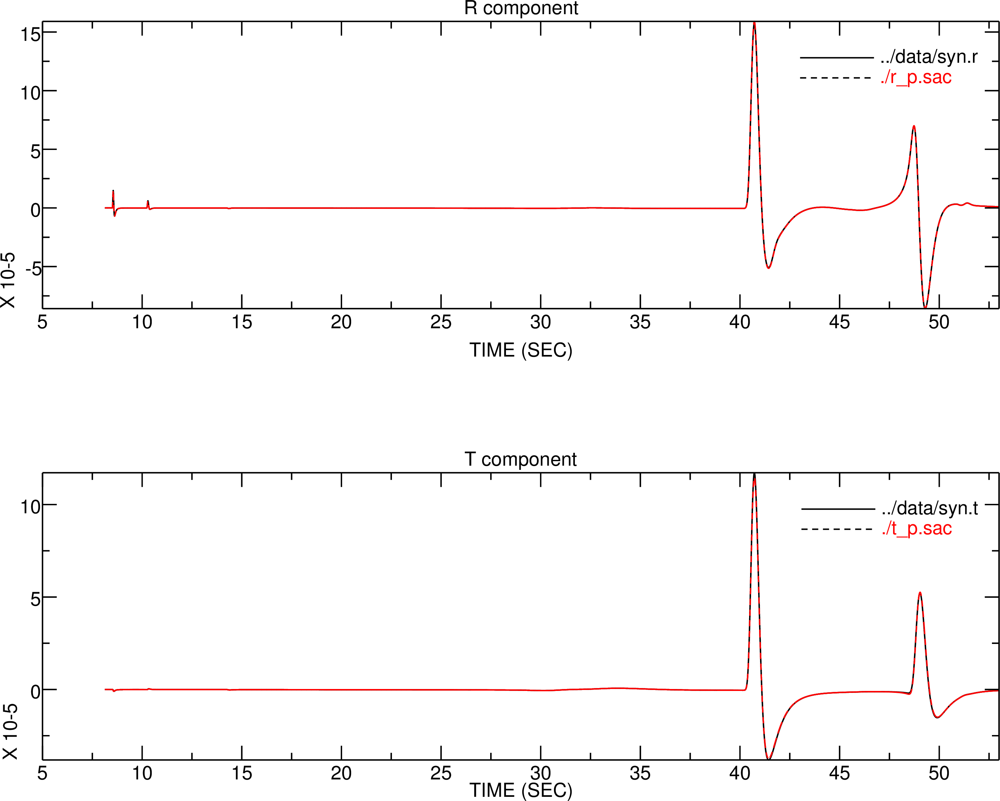
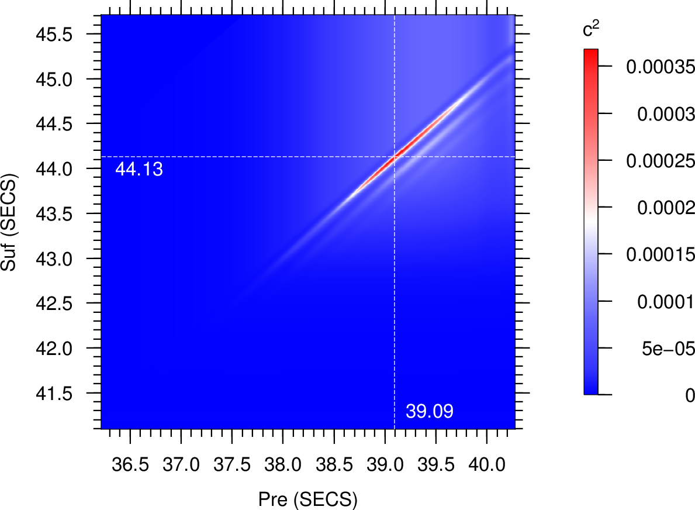
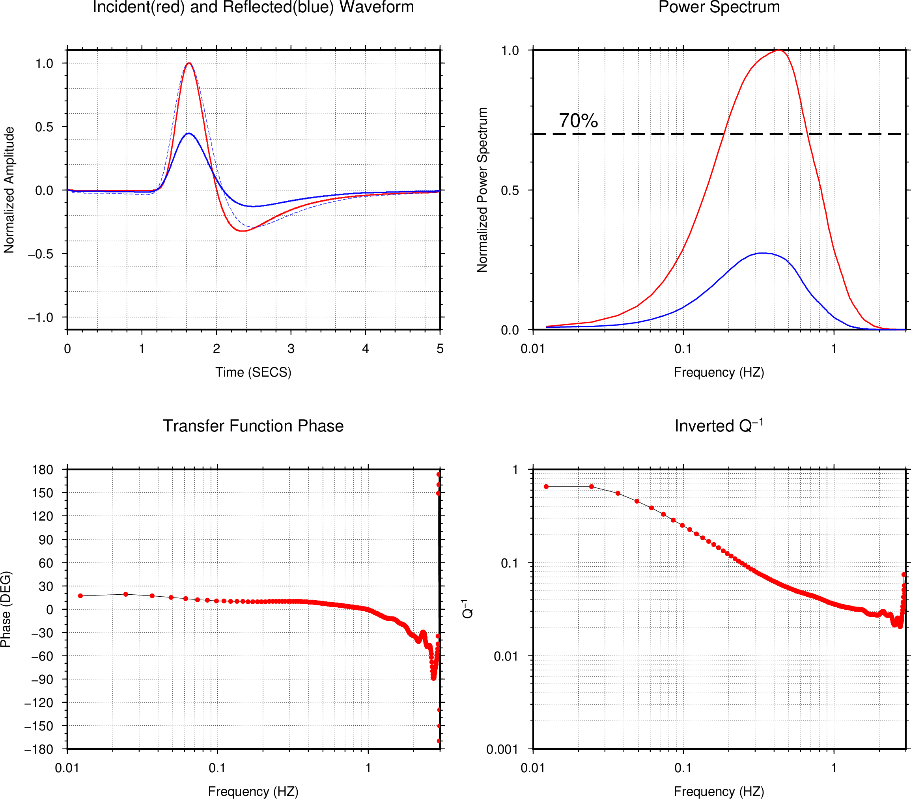

# Qinv

This is a package for attenuation analysis for borehole observation.

Author: Sheng Wang
Email: wangsheng.cas(at)gmail.com

# 1. Prerequest

[`fftw3`](http://www.fftw.org/) is required for this package.

# 2. How to install

```
make
make install
```

# 3. Tools

## Binary

- `polarizeP`: invert the Back-Azimuth given NEZ components, and rotate to radial and the tangential directions.
- `findBestWin`: find the best time window, and lag time for the incident and the surface reflected phases.
- `qinv`: invert the Q value given tangential trace, and the time windows of the incident and the reflected phases.
- `stackQ`: stack the inverted Q values in a single station to get a stable value.

## Script for volume production

- `findBestWinSet.py`: volume production for `findBestWin`.
- `qinvSet.py`: volume production for `qinv`.
- `stackQ.py`: volume production for `stackQ`.

## Binary tests

All binaries of `test_...` are for checking whether this package is correctly installed.

- `test_atten`: 
- `test_crossSpec`: 
- `test_findBestWin`: 
- `test_polarize`: 
- `test_qinv`: 
- `test_qjob`: 
- `test_ranStack`: 
- `test_stackQ`: 
- `test_tracef1d`: 
- `test_tracef1d_Spec`: 
- `test_winopt`: 

# 4. Example

Examples are presented in the directory of `exam/`, and please find the script examples of `run.sh` in each subdirectories.

# 4.1 `exam_polarize_syn/`

Polarization example for synthetic seismograms.



# 4.2 `exam_findBestWin_syn/`

Find the optimal time windows of the incident and the surface reflected phases in synthetic borehole seismogram.



# 4.3 `exam_qinv_syn/`

Invert the Q value given the incident and the surface reflected traces.



